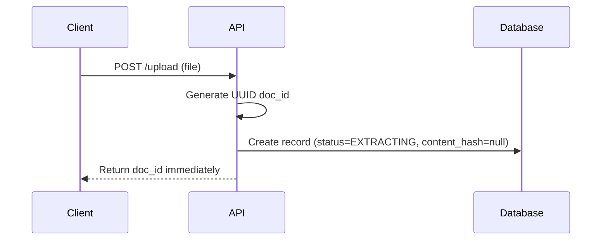
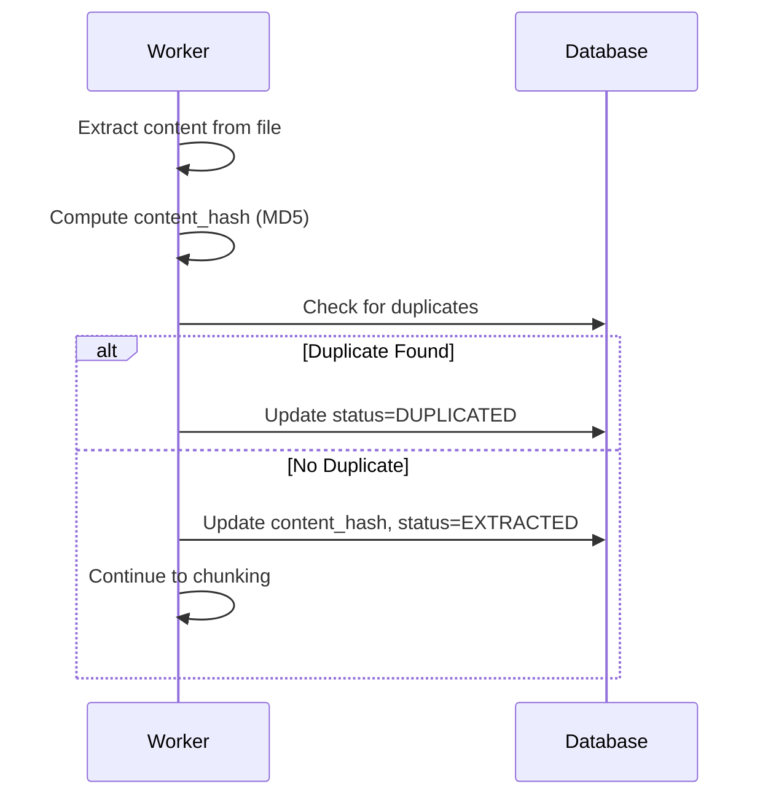
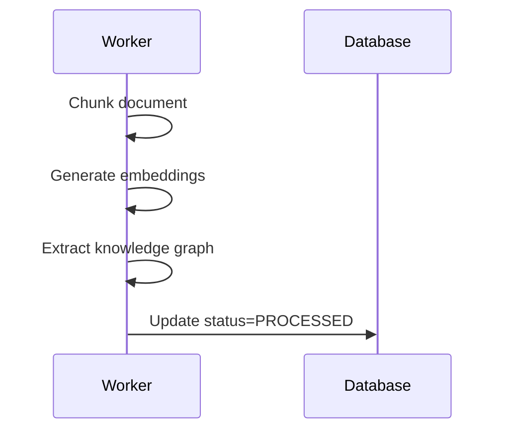

# LightRAG API Documentation

## Overview

This document describes the LightRAG document management API, including the new UUID-based document identification system and migration from the legacy track_id system.

## Document Identification System

### Current System (UUID-based)

Starting from version X.X.X, LightRAG uses UUID-based document identifiers:

- **doc_id format**: `doc-{uuid4}` (e.g., `doc-550e8400-e29b-41d4-a716-446655440000`)
- **Generated**: Immediately upon upload, before content extraction
- **Trackable**: Documents can be queried from the moment of upload
- **Unique**: Each document receives a globally unique identifier

### Legacy System (Hash-based)

Prior versions used content-based MD5 hashing:

- **doc_id format**: `doc-{md5_hash}` (e.g., `doc-a1b2c3d4e5f6...`)
- **Generated**: After content extraction completes
- **Limitation**: Documents not trackable during extraction phase
- **track_id**: Used for batch upload tracking (now removed)

## API Endpoints

### Single File Upload

**Endpoint**: `POST /upload`

**Request**:
```http
POST /upload
Content-Type: multipart/form-data

file: <binary file data>
workspace_id: string
```

**Response** (Current):
```json
{
  "status": "queued",
  "message": "Document queued for processing",
  "workspace_id": "my-workspace",
  "doc_id": "doc-550e8400-e29b-41d4-a716-446655440000",
  "content_hash": null
}
```

**Response Fields**:
- `status`: Processing status (`queued`, `duplicated`, `error`)
- `message`: Human-readable status message
- `workspace_id`: Workspace identifier
- `doc_id`: UUID-based document identifier (available immediately)
- `content_hash`: MD5 hash of content (populated after extraction, null initially)

**Legacy Response** (Deprecated):
```json
{
  "status": "queued",
  "message": "Document queued for processing",
  "workspace_id": "my-workspace",
  "track_id": "track-abc123",  // REMOVED
  "doc_id": null  // Not available until extraction
}
```

### Batch File Upload (Scan)

**Endpoint**: `POST /scan`

**Request**:
```http
POST /scan
Content-Type: application/json

{
  "workspace_id": "my-workspace"
}
```

**Response** (Current):
```json
{
  "status": "queued",
  "message": "Processed 3 files successfully",
  "workspace_id": "my-workspace",
  "doc_ids": [
    "doc-550e8400-e29b-41d4-a716-446655440000",
    "doc-660e8400-e29b-41d4-a716-446655440001",
    "doc-770e8400-e29b-41d4-a716-446655440002"
  ],
  "total_files": 3,
  "queued_files": 3,
  "failed_files": 0
}
```

**Response Fields**:
- `status`: Overall batch status (`queued`, `partial_success`, `error`)
- `message`: Summary message
- `workspace_id`: Workspace identifier
- `doc_ids`: Array of UUID-based document identifiers (one per file)
- `total_files`: Total number of files in batch
- `queued_files`: Number of successfully queued files
- `failed_files`: Number of files that failed to queue

**Legacy Response** (Deprecated):
```json
{
  "status": "queued",
  "message": "Batch upload queued",
  "workspace_id": "my-workspace",
  "track_id": "track-abc123",  // REMOVED
  "total_files": 3
}
```

### Insert Text

**Endpoint**: `POST /insert_text`

**Request**:
```http
POST /insert_text
Content-Type: application/json

{
  "text": "Document content here",
  "workspace_id": "my-workspace"
}
```

**Response** (Current):
```json
{
  "status": "queued",
  "message": "Text document queued for processing",
  "workspace_id": "my-workspace",
  "doc_id": "doc-550e8400-e29b-41d4-a716-446655440000",
  "content_hash": null
}
```

### Insert Multiple Texts

**Endpoint**: `POST /insert_texts`

**Request**:
```http
POST /insert_texts
Content-Type: application/json

{
  "texts": ["Text 1", "Text 2", "Text 3"],
  "workspace_id": "my-workspace"
}
```

**Response** (Current):
```json
{
  "status": "queued",
  "message": "Processed 3 texts successfully",
  "workspace_id": "my-workspace",
  "doc_ids": [
    "doc-550e8400-e29b-41d4-a716-446655440000",
    "doc-660e8400-e29b-41d4-a716-446655440001",
    "doc-770e8400-e29b-41d4-a716-446655440002"
  ],
  "total_files": 3,
  "queued_files": 3,
  "failed_files": 0
}
```

### Get Document Status

**Endpoint**: `GET /documents/{doc_id}`

**Request**:
```http
GET /documents/doc-550e8400-e29b-41d4-a716-446655440000
```

**Response**:
```json
{
  "doc_id": "doc-550e8400-e29b-41d4-a716-446655440000",
  "status": "EXTRACTED",
  "content_hash": "a1b2c3d4e5f6789012345678901234567",
  "content_summary": "This document discusses...",
  "created_at": "2026-04-17T10:30:00Z",
  "updated_at": "2026-04-17T10:31:00Z",
  "error_msg": null
}
```

**Status Values**:
- `EXTRACTING`: Content extraction in progress (content_hash is null)
- `EXTRACTED`: Content extracted successfully (content_hash populated)
- `PROCESSED`: Document fully processed and indexed
- `DUPLICATED`: Duplicate content detected (see metadata for original doc_id)
- `FAILED`: Processing failed (see error_msg for details)

### Track Status (Deprecated)

**Endpoint**: `GET /track_status/{track_id}` - **REMOVED**

This endpoint has been removed. Use individual document status queries instead:

**Migration**:
```javascript
// Old approach (deprecated)
const response = await fetch(`/track_status/${track_id}`);

// New approach
const doc_ids = uploadResponse.doc_ids;
for (const doc_id of doc_ids) {
  const status = await fetch(`/documents/${doc_id}`);
  console.log(`${doc_id}: ${status.status}`);
}
```

## Document Lifecycle

### 1. Upload Phase



**Key Points**:
- doc_id available immediately
- Document queryable from upload
- content_hash is null during this phase

### 2. Extraction Phase



**Key Points**:
- content_hash computed after extraction
- Duplicate detection uses content_hash
- Original doc_id preserved regardless of duplicate status

### 3. Processing Phase



## Duplicate Detection

### How It Works

1. **Content Hash**: MD5 hash computed from sanitized document content
2. **Duplicate Check**: Query database for matching content_hash in same workspace
3. **Self-Exclusion**: Current document excluded from duplicate search
4. **Status Update**: Duplicate documents marked as DUPLICATED with reference to original

### Example

```javascript
// Upload same file twice
const response1 = await uploadFile(file);
// Returns: { doc_id: "doc-uuid1", status: "queued" }

const response2 = await uploadFile(file);
// Returns: { doc_id: "doc-uuid2", status: "queued" }

// After extraction completes
const status1 = await getDocStatus(response1.doc_id);
// Returns: { status: "EXTRACTED", content_hash: "abc123..." }

const status2 = await getDocStatus(response2.doc_id);
// Returns: { 
//   status: "DUPLICATED", 
//   content_hash: "abc123...",
//   metadata: { duplicate_of: "doc-uuid1" }
// }
```

## Error Handling

### Extraction Failures

When content extraction fails:

```json
{
  "doc_id": "doc-550e8400-e29b-41d4-a716-446655440000",
  "status": "FAILED",
  "content_hash": null,
  "error_msg": "Unsupported file format: .xyz",
  "created_at": "2026-04-17T10:30:00Z",
  "updated_at": "2026-04-17T10:31:00Z"
}
```

**Key Points**:
- doc_id remains queryable
- content_hash stays null
- error_msg contains failure details
- Status can be monitored for debugging

### UUID Collisions

Extremely rare (probability < 10^-18), but handled automatically:

1. Collision detected during insert
2. System retries with new UUID
3. Process transparent to client
4. Collision logged for monitoring

## Client Migration Guide

### Migrating from track_id to doc_id

#### Single File Upload

**Before**:
```javascript
const response = await fetch('/upload', {
  method: 'POST',
  body: formData
});

const { track_id } = await response.json();
// Wait for extraction...
const status = await fetch(`/track_status/${track_id}`);
const { doc_id } = await status.json();
```

**After**:
```javascript
const response = await fetch('/upload', {
  method: 'POST',
  body: formData
});

const { doc_id } = await response.json();
// doc_id available immediately!
const status = await fetch(`/documents/${doc_id}`);
```

#### Batch Upload

**Before**:
```javascript
const response = await fetch('/scan', {
  method: 'POST',
  body: JSON.stringify({ workspace_id: 'my-workspace' })
});

const { track_id } = await response.json();
// Poll track status
const status = await fetch(`/track_status/${track_id}`);
const { documents } = await status.json();
```

**After**:
```javascript
const response = await fetch('/scan', {
  method: 'POST',
  body: JSON.stringify({ workspace_id: 'my-workspace' })
});

const { doc_ids } = await response.json();
// Poll each document individually
for (const doc_id of doc_ids) {
  const status = await fetch(`/documents/${doc_id}`);
  console.log(`${doc_id}: ${status.status}`);
}
```

#### Client-Side Batch Tracking (Optional)

If you need to track batches client-side:

```javascript
class BatchTracker {
  constructor(doc_ids) {
    this.doc_ids = doc_ids;
    this.statuses = new Map();
  }

  async updateStatuses() {
    for (const doc_id of this.doc_ids) {
      const response = await fetch(`/documents/${doc_id}`);
      const status = await response.json();
      this.statuses.set(doc_id, status.status);
    }
  }

  getSummary() {
    const summary = {};
    for (const status of this.statuses.values()) {
      summary[status] = (summary[status] || 0) + 1;
    }
    return summary;
  }

  isComplete() {
    return Array.from(this.statuses.values())
      .every(s => ['PROCESSED', 'DUPLICATED', 'FAILED'].includes(s));
  }
}

// Usage
const response = await uploadBatch(files);
const tracker = new BatchTracker(response.doc_ids);

const interval = setInterval(async () => {
  await tracker.updateStatuses();
  console.log(tracker.getSummary());
  
  if (tracker.isComplete()) {
    clearInterval(interval);
    console.log('Batch complete!');
  }
}, 2000);
```

### Breaking Changes Summary

| Feature | Old Behavior | New Behavior |
|---------|-------------|--------------|
| Single upload response | Returns `track_id`, `doc_id` null | Returns `doc_id` immediately, no `track_id` |
| Batch upload response | Returns `track_id` | Returns `doc_ids` array, no `track_id` |
| Document tracking | Use `/track_status/{track_id}` | Use `/documents/{doc_id}` |
| doc_id format | `doc-{md5_hash}` | `doc-{uuid4}` |
| doc_id availability | After extraction | Immediately on upload |
| Batch tracking | Server-side via track_id | Client-side via doc_ids array |

### Backward Compatibility

#### Querying Old Documents

Documents created before migration retain their hash-based doc_ids:

```javascript
// Old doc_id format still works
const status = await fetch('/documents/doc-a1b2c3d4e5f6...');
// Returns document status normally
```

#### Transition Period

During migration:
- New uploads receive UUID-based doc_ids
- Old documents keep hash-based doc_ids
- Both formats supported in queries
- content_hash field populated for all documents

#### Deprecation Timeline

- **Version X.X.X**: UUID system introduced, track_id deprecated
- **Version X.X+1**: track_id endpoints removed
- **Version X.X+2**: Hash-based doc_id support may be removed (TBD)

## Performance Considerations

### Duplicate Detection

- **Index**: Database index on `(workspace, content_hash)` for O(log n) lookups
- **Query**: Uses `LIMIT 1` to stop after first match
- **Scope**: Only searches within same workspace

### Concurrent Uploads

- **UUID Generation**: Thread-safe, no coordination needed
- **Document Creation**: Atomic database transactions
- **Duplicate Detection**: Runs after extraction, handles race conditions

### Batch Operations

- **Parallel Processing**: Each document processed independently
- **Failure Isolation**: One file failure doesn't affect others
- **Progress Tracking**: Poll individual doc_ids for granular status

## Best Practices

### 1. Store doc_id Immediately

```javascript
// Good: Store doc_id from upload response
const { doc_id } = await uploadFile(file);
localStorage.setItem(`upload_${file.name}`, doc_id);

// Bad: Wait for extraction to get doc_id
// (This was necessary with old system, not anymore!)
```

### 2. Poll Individual Documents

```javascript
// Good: Poll each document for status
for (const doc_id of doc_ids) {
  const status = await getDocStatus(doc_id);
  updateUI(doc_id, status);
}

// Avoid: Trying to use track_id (removed)
```

### 3. Handle Duplicates Gracefully

```javascript
const status = await getDocStatus(doc_id);

if (status.status === 'DUPLICATED') {
  const original_id = status.metadata.duplicate_of;
  console.log(`Document is duplicate of ${original_id}`);
  // Optionally redirect to original document
}
```

### 4. Implement Retry Logic

```javascript
async function uploadWithRetry(file, maxRetries = 3) {
  for (let i = 0; i < maxRetries; i++) {
    try {
      const response = await uploadFile(file);
      return response.doc_id;
    } catch (error) {
      if (i === maxRetries - 1) throw error;
      await sleep(1000 * Math.pow(2, i)); // Exponential backoff
    }
  }
}
```

### 5. Monitor Extraction Progress

```javascript
async function waitForExtraction(doc_id, timeout = 60000) {
  const start = Date.now();
  
  while (Date.now() - start < timeout) {
    const status = await getDocStatus(doc_id);
    
    if (status.status === 'EXTRACTED' || 
        status.status === 'PROCESSED') {
      return status;
    }
    
    if (status.status === 'FAILED') {
      throw new Error(status.error_msg);
    }
    
    await sleep(2000);
  }
  
  throw new Error('Extraction timeout');
}
```

## Additional Resources

- [Migration Runbook](./MigrationRunbook.md) - Detailed migration procedures
- [Backward Compatibility Guide](./BackwardCompatibility.md) - Transition strategies
- [API Reference](./APIReference.md) - Complete endpoint documentation
